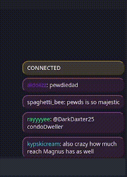

Version with Twitch emotes support can be found in the [emotes branch](https://github.com/yurimimi/twitch_chat_overlay/tree/emotes). Still does not support Twitch badges or third-party emotes.

### How to

To add this thing to your OBS:

1. In your OBS Sources (next to the Scenes by default) click the '+' button
2. Click Browser
3. Click Ok on the new window
4. Check the Local file checkbox and below it you'll see the Local file line with a button 'Browse', click the button
5. Select the index.html file (in the docs directory)
6. You should see something like in the example below

To make it connect to your channel, replace YOUR_CHANNEL_NAME in the index.html

```html
<meta name="channel_name" content="YOUR_CHANNEL_NAME" />
```

with your channel name. For example, `content="mimeyu"`.

### Example



### To edit the script

To edit something in the script, you'll need [NPM](https://nodejs.org/en/download) and to install the packages with it being in the repo directory.

```
npm i
```

Then run

```
npm run build
```

to watch for changes in the code. Open the index.html file in your browser to debug.
